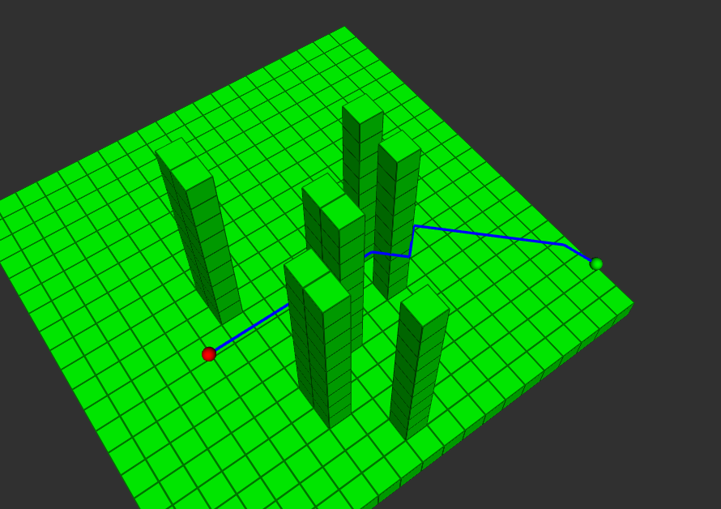
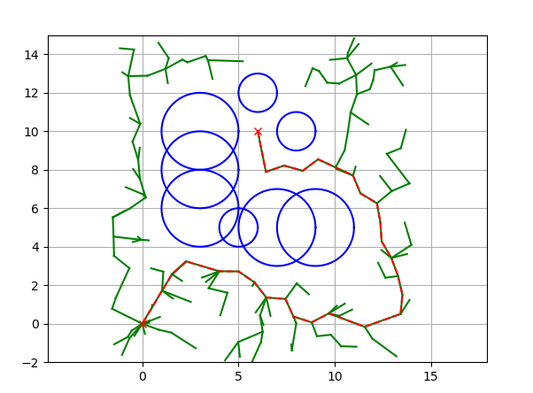
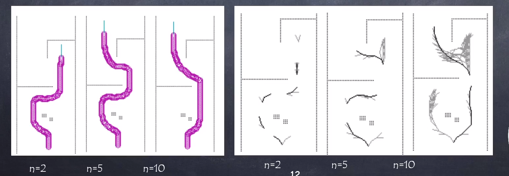

# Системы обхода препятствий

Системы планирования маршрута и ухода от препятствий играют ключевую роль в области мобильной робототехники. Эти системы позволяют роботам определять оптимальный маршрут от начальной до конечной точки с учётом различных физических и динамических ограничений. Однако задача планирования маршрута становится более сложной, когда робот находится в переменчивой или неизвестной среде, где препятствия могут появляться неожиданно.

**Основная цель систем планирования маршрута** — обеспечить безопасное и эффективное перемещение робота, минимизируя возможные столкновения, и оптимизировать траекторию движения по времени или расстоянию.

Для успешного планирования маршрута и ухода от препятствий алгоритмы и методы должны сочетать в себе быстродействие и точность, а также устойчивость к изменениям в окружающей среде. С развитием технологий и исследований в этой области роботы становятся всё более автономными и способными справляться со сложными задачами в реальном мире.

Как мы помним из видео, существуют две концепции планирования: локальная и глобальная.

## Глобальное планирование

---

Источник: Михаил Колодочка. Пример работы **A*** в реализации для трёхмерного пространства

---

**Глобальное планирование** — это процесс определения пути от начальной до конечной точки в известной или частично известной среде. Основная цель глобального планирования — создание маршрута, оптимального по определённым критериям: минимальному расстоянию или времени перемещения. При этом маршрут должен избегать известных ранее препятствий. Этот процесс предполагает, что у робота есть карта окружающей среды, хотя карта может быть **неточной или устаревшей**.

Существует несколько методов, которые используются в глобальном планировании. Один из наиболее популярных подходов — планирование с использованием представления карты в виде вокселей. Такую карту вы рассматривали и программировали в предыдущем модуле.

На основе этой карты можно запустить такие алгоритмы поиска, как A* (который подробно рассматривался в видео), в этом случае карту используют для нахождения оптимального пути от начальной до конечной точки.

Другим популярным алгоритмом является **RRT***. **RRT (Rapidly-exploring Random Trees)** — это метод планирования, который исследует пространство путём создания дерева, расширяющегося от начальной точки к случайным точкам в этом пространстве. Преимущество RRT заключается в том, что он способен быстро исследовать и адаптироваться к сложным и высокоразмерным пространствам. Данный подход также коротко рассматривался в видео.

Глобальный подход базируется на том, что маршрут, как правило, генерируется на основе глобальной карты, полученной ранее или составляемой в процессе полёта. Часто данный подход используется на больших массивах данных, поэтому маршрут не удаётся получать с большой частотой. Как было замечено вначале, главный недостаток такого подхода в том, что карта может быть неполной либо аппарат могут ожидать динамические препятствия, например автомобили. Так как генерация нового маршрута — сложная и длительная задача, данный подход можно дополнить системами локального планирования.

Например, локальный планировщик может работать с большой частотой, избегать локальных коллизий и дополнять при этом глобальный алгоритм планирования, работающий с меньшей частотой. Другой подход предполагает использование ограниченного пространства для получения решения. Например, карты на основе кольцевого массива позволяют использовать для планирования небольшую карту, создаваемую вокруг аппарата.

Глобальные алгоритмы планирования позволяют получить более оптимальные маршруты, однако требуют больших вычислительных ресурсов. Глобальные планировщики необходимы в плотных и сложных средах, где оптимальные планировщики могут не справиться и попасть в локальный минимум. Однако чаще всего использование всей карты для построения маршрута избыточно и, как правило, необходимо только на начальном этапе планирования маршрута при наличии карты.

### RRT*

Ранее мы подробно рассмотрели алгоритм A* и разобрали, как работает алгоритм случайного поиска. Объединение двух этих подходов позволяет существенно улучшить подход RRT, который в обособленном виде, как правило, неприменим.

Изображение: [github.com](https://github.com/AtsushiSakai/PythonRobotics)

Пошагово рассмотрим как работает данный алгоритм:

1) **Инициализация**: Начинаем с инициализации дерева, включающего в себя начальную точку (или конфигурацию). Эта точка является корнем дерева.

2) **Случайный выбор**: На каждом шаге алгоритма выбирается случайная точка в пространстве поиска.

3) **Нахождение ближайшей вершины**: Из всех точек в дереве выбирается та, которая находится ближе всего к случайно выбранной точке.

4) **Расширение дерева**: От ближайшей вершины строится путь к случайно выбранной точке, но только на заданное максимальное расстояние (чтобы избежать слишком больших шагов).

5) **Проверка  препятствия**: Путь проверяется на отсутствие препятствий. Если путь свободен, новая точка добавляется в дерево.

6) **Оптимизация маршрута**: В отличие от **RRT**, **RRT** включает шаг пересмотра родительских узлов. Для каждой новой точки алгоритм ищет, не существует ли более короткого пути к этой точке через другие узлы дерева, и при необходимости перенастраивает связи в дереве.

Эти шаги повторяются до тех пор, пока не будет достигнута целевая точка или не истечет заданное время поиска.

После достижения цели строится конечный путь от начальной точки к целевой, двигаясь по связям в дереве в обратном порядке. Этот шаг как раз выполняется c помощью алгоритма **A***

## Локальное планирование

В то время как глобальное планирование фокусируется на определении общего пути в известной среде, локальное адаптируется к текущей ситуации, позволяя роботу избегать неожиданных препятствий на пути. В автопилотах, таких как PX4 или Ardupilot, чаще всего встречаются локальные алгоритмы планирования, так как они достаточно просты с вычислительной точки зрения и даже могут быть встроены в бортовое ПО автопилота.

В отличие от глобального планирования локальные планировщики должны быстро реагировать на изменения и предоставлять решения в реальном времени.

**Метод VFH+ (гистограмма векторного поля)** один из самых распространённых, он основан на идее создания гистограммы поля вокруг мобильного робота. Гистограмма создаётся на основе данных с датчиков робота, таких как лидар или ультразвуковые датчики.

Сначала строится полярная гистограмма препятствий, которая затем бинаризуется для определения заблокированных и свободных направлений. На основе этой бинаризованной гистограммы робот принимает решение о том, какое направление движения выбрать. VFH+ также учитывает динамические свойства робота, такие как его минимальный радиус разворота, что делает его подходящим для реального времени и динамичных сред. Это один из самых распространённых подходов. 

Другой модификацией является алгоритм VFH*, который использует A* для нахождения локального маршрута на основе текущих измерений робота. VFH* — это локальный алгоритм, который в качестве карты использует текущие измерения датчиков, однако в качестве ветвей для **A*** используются решения, полученные при помощи VFH. Пример работы такого алгоритма можно видеть ниже.

[Источник](https://www.youtube.com/watch?app=desktop&v=X0nokJwoivQ)

Как видно на рисунке, в зависимости от количества шагов итоговая траектория, полученная при движении робота, может отличаться. Маршруты, приведённые в примере, криволинейные, так как рассматривается движение колёсного робота. В случае БЛА мультироторного типа участки траектории были бы прямолинейными, так как он может свободно двигаться в любом направлении.

**VFH3D** является расширением исходного метода VFH для работы в трёхмерных средах, что особенно полезно для летательных аппаратов, таких как дроны. В то время как стандартный VFH анализирует окружающую среду в двух измерениях (в горизонтальной плоскости), VFH3D делает это в трёх измерениях, учитывая препятствия сверху и снизу, а также ориентацию аппарата. Это позволяет летательным аппаратам эффективно избегать препятствий на разных высотах и в разных направлениях полёта. Такой подход особенно ценен в сложных трёхмерных средах с множеством препятствий на разных уровнях.

Для локального планирования можно использовать методы A* и RRT. Несмотря на то что они ассоциируются с глобальным планированием, их используют и для планирования маршрута в локальной области вокруг аппарата.

В общем, локальное планирование играет решающую роль в обеспечении роботу возможности реагировать на непредсказуемые препятствия и ситуации в реальном времени. Выбор метода локального планирования зависит от особенностей робота, его окружения и конкретных задач, которые перед ним стоят. Однако стоит отметить, что в большинстве задач можно ограничиться локальными методами планирования маршрута.

## Полезные ссылки

* [Статья](https://github.com/uzh-rpg/agile_autonomy)
 на английском об облёте препятствий БЛА на большой скорости на основе глубокого обучения.

* Пример реализации алгоритма [VFH3d+](https://github.com/PX4/PX4-Avoidance) и [статья](https://ceur-ws.org/Vol-1319/morse14_paper_08.pdf) на английском об этом.

* [Статья](https://drive.google.com/file/d/1hZBBV6zNEpX1OYv_-U6flbC2gmNjqy-L/edit) на английском о построении маршрутов БЛА на основе функции потерь.

* [Статья](https://drive.google.com/file/d/1EhjTvv1QyUxfdnQnBQcPc-T3Zg3OMnlD/edit?pli=1) на английском об облёте препятствий на основе алгоритма 3DVFH*.