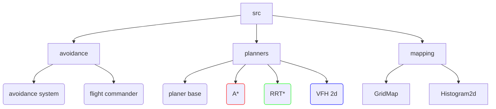
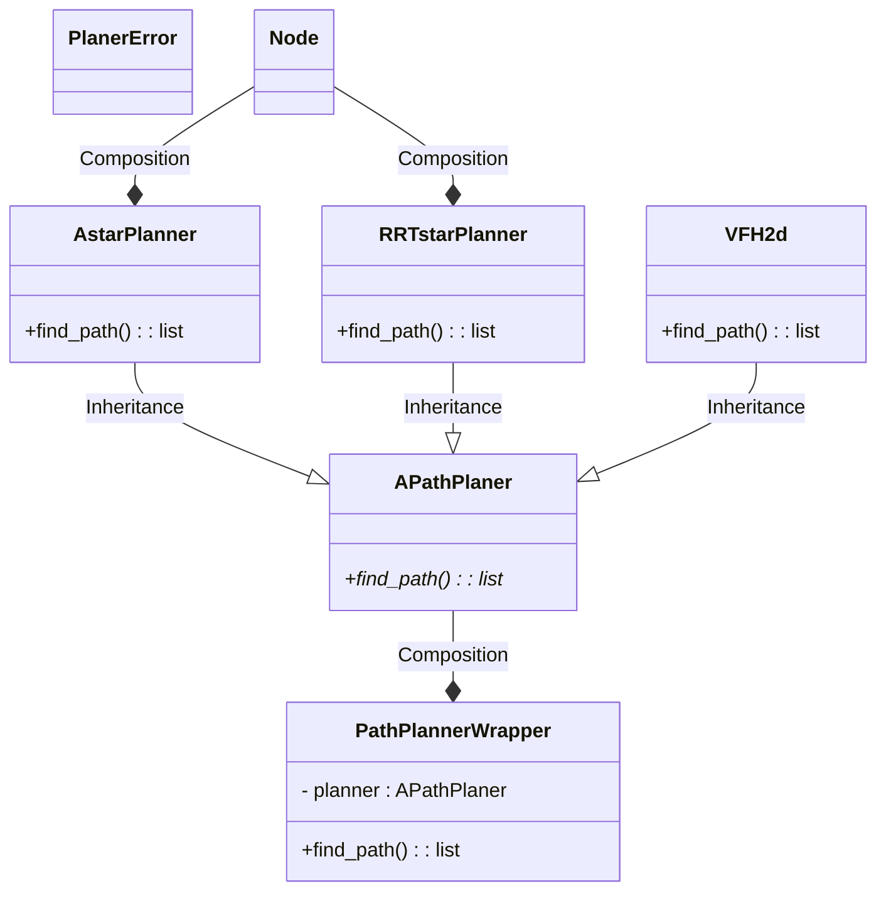
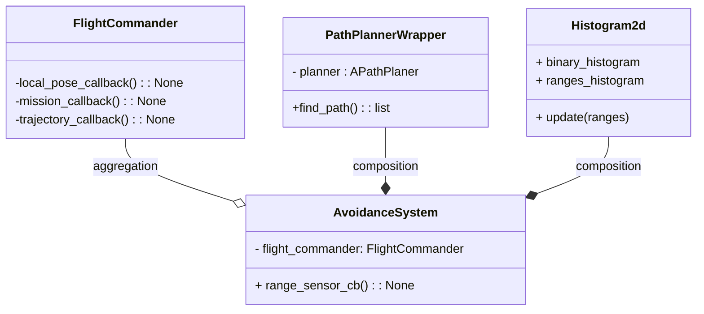
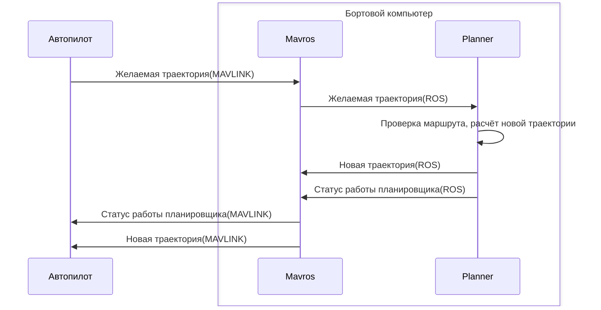
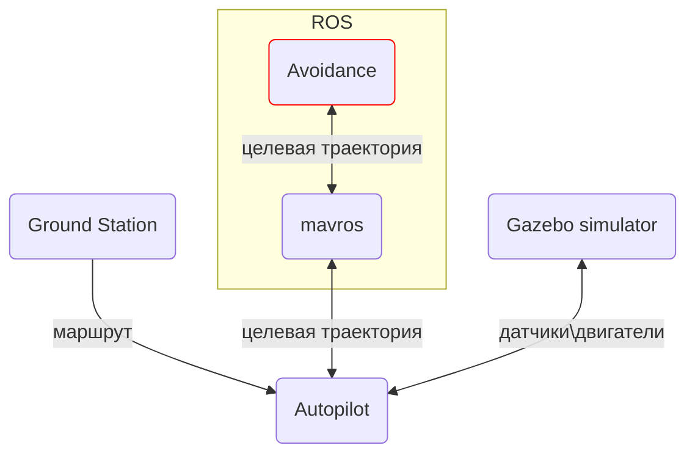
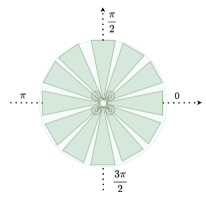
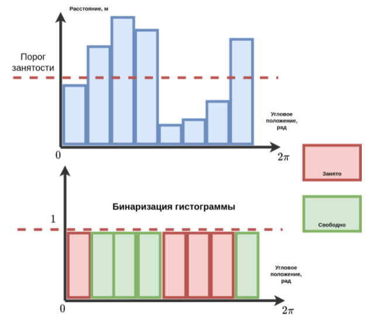
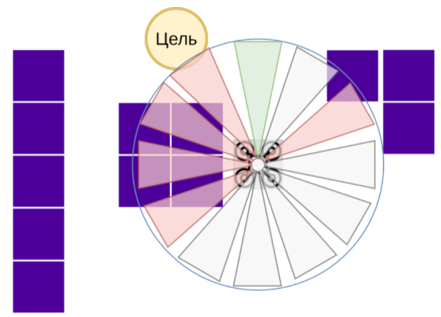

# Создание системы ухода от препятствий

---


Изображение: Михаил Колодочка

---


Познакомимся с содержанием репозитория. В папке `src` представлено три модуля `avoidance`, `planners` и `mapping`. Эти модули представляют собой системы облёта препятствий и планирования препятствий соответственно. Ниже можно видеть иерархию.


Изображение: Михаил Колодочка


Далее коротко рассмотрим содержание модулей, обсудим, что делают примеры кода, как использовать визуализацию и какой механизм сообщений использует автопилот для ухода от препятствий.

Для начала рассмотрим модуль **planners**. Модуль содержит базовый класс для систем обхода препятствий (planer base) и три системы планирования маршрута. Методы A* и двумерный вариант гистограммы векторного поля VFH мы рассмотрели в видео, а метод **RRT*** —  [в теоретической части](../avoidance_guide.md). 

В данном модуле используется следующая иерархия классов:


Изображение: Михаил Колодочка


В данном случае взаимодействие с планировщиками **(A* RRT* VFH)** происходит через класс-обёртку PathPlannerWrapper, которая предоставляет общий интерфейс для использования разных систем планирования. Node является описанием узла графа, по которым производится поиск, в нашем случае поиск будет осуществляться по ячейкам карты. В случае ошибки в работе системы планирования код выдаст исключение типа **PlanerError**. 

Разные планировщики маршрута имеют свои особенности применения, например алгоритм VFH в качестве карты принимает на вход измерения дальности и сообщает желаемые координаты в связной СК, так как датчик жёстко связан с самим аппаратом. В связи с этим данные перед использованием необходимо перепроектировать в неподвижную СК. A* и RRT* являются глобальными планировщиками и на вход принимают карту с сеткой занятости (GridMap).
 

Далее рассмотрим более детально содержание модуля **Avoidance**


Изображение: Михаил Колодочка


Модуль состоит из двух основных классов — **FlightCommander** и **AvoidanceSystem**. **FlightCommander** представляет собой интерфейс для получения данных об аппарате и отправке команд управления. AvoidanceSystem представляет собой реализацию алгоритма облёта препятствий, куда входит планировщик маршрута и **FlightCommander**. **AvoidanceSystem** получает данные с дальнометрического датчика, проверяет наличие препятствий и при необходимости переопределяет маршрут полёта для ухода от препятствий. При этом в качестве карты используется Histogram2d, так как мы рассматриваем работу алгоритма **VFH+**. Гистограмма обновляется при получении данных с датчика и далее используется планировщиком для определения маршрута ЛА.


В приведённом коде есть подробные комментарии, которые помогут вам разобраться с тем, как работает код и что требуется сделать в практической работе.
В папке с примерами можно найти следующие файлы:

- [avoidance_node.py](../scripts/examples/planner_example_node.py) — программа на основе ROS для облёта препятствий; взаимодействует с MAVROS и дальнометрическими датчиками (камерой или лидаром);


- [planner_example_node.py](../scripts/examples/avoidance_node.py) — программа-пример, демонстрирующая работу систем планирования маршрутов A* и RRT*;


- [simple_grid_map.py](../src/mapping/simple_grid_map.py) — программа с простой картой; заполняет карту вокселями, может сохранять и читать карту из файла.


Примеры алгоритмов A* и RRT* позволят лучше ознакомиться с принципами работы систем планирования и послужат заготовкой для итоговой работы. Для применения данных методов при облёте препятствий необходимо, чтобы карта учитывала размер аппарата даже при диагональном проходе элементов. Также конечный маршрут лучше всего дополнительно сгладить, чтобы траектория была более плавной.


## Механизм переопределения маршрута в PX4

Для планирования маршрутов в PX4 существует специальный интерфейс для управления траекторией БЛА с бортового компьютера (companion computer). Этот интерфейс обеспечивает передачу желаемых траекторий при помощи [mavlink](https://mavlink.io/en/services/trajectory.html).

Траектория БЛА передаётся на бортовой компьютер. Система планирования маршрута на одноплитном ПК может переопределить маршрут либо отправить полученное сообщение в ответ, если маршрут будет достаточно безопасным. В ответ также отправляется специальное heartbeat-сообщение **CompanionProcessStatus**, которое информирует автопилот о корректном состоянии системы ухода от препятствий. Если оно не будет приходить, автопилот будет считать, что система планирования не работает.



Изображение: Михаил Колодочка


Данный механизм реализован в классе **FlightCommander**. При обнаружении препятствия будет необходимо обновлять желаемую траекторию БЛА.

## Подготовка окружения

Выполним инициализацию окружения для Python.

```bash
python3 -m venv venv --system-site-packages
```


Активируем виртуальное окружение python.

```bash
source venv/bin/activate
```


```bash
pip install -r requirements.txt
```

Установим локальные зависимости а именно avoidance, planners и mapping.

```bash
pip install -e .
```

В случае использования Docker-контейнера также необходимо установить эти зависимости.

---

ROS использует системный Python, поэтому требуется установка без venv.

---

# Запуск моделирования

Моделирование для практической работы будем проводить в симуляторе **Gazebo**.

Для запуска можно использовать [docker](docker_install.md) либо выполнить запуск скрипта `./start_sh`

В результате должна появиться карта с аппаратом и препятствиями вокруг.


# Практическая работа


В рамках практической работы необходимо доработать код в файлах [vfh2d.py](../src/planners/vfh2d_planner.py) и [avoidance_system.py](../src/avoidance/avoidance_system.py) и реализовать работоспособную систему облёта препятствий, пример работы которой был рассмотрен выше. В приведённых файлах вы сможете найти подсказки и подробные комментарии к коду.


В рамках домашней работы требуется доработать код в файлах  и , и реализовать работоспособную систему облета препятствий, пример работы которой был рассмотрен выше. В приведенных файлах вы сможете найти подсказки и подробные комментарии к коду. Также требуется выполнить реализацию 

Пример работы гистограммы для VFH+ приведен ниже. Реализовать работу гистограммы нужно в файле: [histogram2d.py](../src/mapping/histogram2d.py)

---

Изображение: Михаил Колодочка

На изображении вы видите полярное отображение гистограммы и её развёрнутое представление, в том числе в бинарном виде.


---

Рассмотрим порядок работы системы облёта препятствий.

- Запуск системы моделирования. Необходимо запустить систему моделирования по аналогии с описанием выше, при помощи скрипта 
[start_sim.sh](../scripts/start_sim.sh) или с использованием [docker](.docs/docker_install.md) (подробный разбор использования docker был рассмотрен [ранее](https://gitlab.com/drone-programming/skillbox/module_5/-/blob/master/docs/docker_usage.md?ref_type=heads)).

- Запуск [программы](../scripts/examples/avoidance_node.py) системы облёта препятствий. При выполнении задания на C++ необходимо добавить все необходимые зависимости в файл CMakeLists.txt и выполнить установку пакета. Рекомендуется запускать программу через команду rosrun либо добавить программу в [файл](launch/uav_simulator.launch) конфигурации.

- Запуск наземной станции QgroundControl и загрузка полётного задания на борт БЛА.

- Далее необходимо выполнить взлёт БЛА и запустить полётное задание.

- При обнаружении препятствий аппарат должен выполнять облёт и добраться до конечной точки маршрута.


Рассмотрим схему работы системы:



# Создание простого алгоритма облета на основе VFH

Рассмотрим детально, как сделать облёт препятствий при помощи алгоритма VFH. Алгоритм является локальным планировщиком и не использует всю карту целиком для построения маршрута. Концепции глобального и локального планирования мы обсудили в видео к восьмому модулю. В отличие от A* или RRT* алгоритм возвращает не путь от точки к точке, а направление полёта или точку в окрестности аппарата. Как следует из названия, алгоритм использует гистограмму в качестве карты.


<p align="center">
    
</p>
<p align="center">
    <strong>Изображение: </strong> Михаил Колодочка
</p>

Данная гистограмма строится на основе данных дальнометрического датчика. При построении гистограммы для каждого сегмента устанавливается дальность минимального измерения, попадающая в область ячейки.

Сегмент считается незанятым, если в него не попадают объекты на допустимой дистанции, или занятым в противном случае. Гистограмма — это простая дискретная карта, показывающая препятствия вокруг БЛА. Процесс определения занятости ячейки называют бинаризацией гистограммы.

Если развернуть данную гистограмму и размером каждого столбика сделать минимальную дальность, получим следующую картину.


<p align="center">
    
</p>
<p align="center">
    <strong>Изображение: </strong> Михаил Колодочка
</p>

Для определения точки, в которую можно лететь, выберите свободную ячейку гистограммы, ближайшую по направлению к целевой точке. Для этого определите угловое положение целевой точки при помощи функции арктангенса `arctan2(y, x)`. Далее найдите свободный сегмент с минимальным угловым отклонением от направления на целевую точку. После сформируйте точку, в которую требуется лететь относительно связной СК.


Для полёта необходимо формировать гистограмму в неподвижной системе координат, чтобы можно было получать новую целевую точку без дополнительных преобразований.

<p align="center">
    
</p>
<p align="center">
    <strong>Изображение: </strong> Михаил Колодочка
</p>

