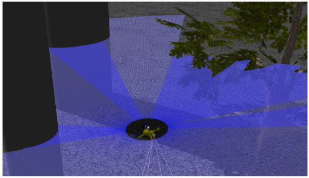

# Облёт препятствий и планирование маршрута

Системы планирования маршрута играют критически важную роль в мобильной робототехнике. Они позволяют роботу двигаться из одной точки в другую, минимизируя столкновения с препятствиями и оптимизируя маршрут по определённым критериям.

    

    <strong>Источник: </strong> Михаил Колодочка

Мы говорили о том, что существуют локальные и глобальные системы планирования, и рассмотрели некоторые из них. Для более детального знакомства с системами планирования маршрута рекомендуем ознакомиться с [теоретическим матерьялом](.docs/avoidance_guide.md).

Практическая работа в данном модуле подразумевает создание своей системы облёта препятствий. В рамках задания рассматривается создание простого алгоритма локального планирования. Подробную инструкцию по выполнению задания можно найти [далее](.docs/avoidance_programming.md).

